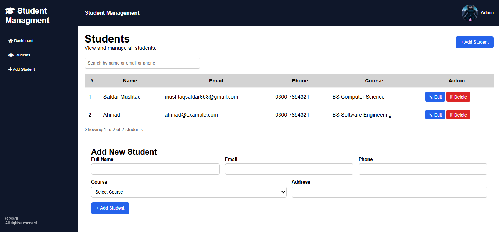

# Student Management System

A web application to manage student records. You can add, edit, delete, and search students.

Technologies Used

- Frontend: HTML, CSS, JavaScript
- Backend: Node.js, Express.js
- Database: MongoDB

Features

- Add new students
- Edit student data
- Delete student data
- Search students
- Responsive design for mobile devices

Screenshot

### Homepage



## How to Run

1. Clone the repository and enter the folder:

   ```bash
   git clone <your-github-repository-url>
   cd student-management-system
   ```

2. Install dependencies:

   ```bash
   npm install
   ```

3. Create a `.env` file in the project root:

   ```env
   PORT=3000
   MONGO_URI=your_mongodb_connection_string
   ```

4. Start the server:

   ```bash
   npm start
   ```

   For development with automatic restart, use `npm run dev`.

5. Open in browser:

   http://localhost:3000

`npm test` runs JavaScript syntax checks for the application files.

Author

Safdar - https://github.com/CoderSafdar
